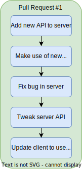
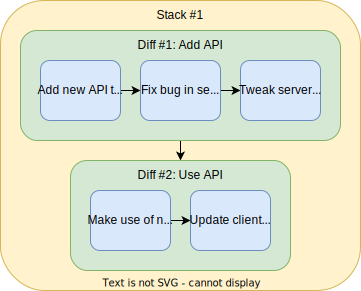

Stacked Diffs
=============

A quick tl;dr guide for people who are already familiar with Pull Requests

<table>
<tr>
	<th width="20%"></th>
	<th width="40%">Pull Request Workflow</th>
	<th width="40%">Stacked Diff Workflow</th>
</tr>
<tr class="images">
	<td></td>
	<td></td>
	<td></td>
</tr>
<tr>
	<td>Concept</td>
	<td>
		<ul>
			<li>Code evolves in one dimension:</li>
			<ul>
				<li>"bad" &rarr; "better"</li>
			</ul>
		</ul>
	</td>
	<td>
		<ul>
			<li>Code evolves in two dimensions:</li>
			<ul>
				<li>"No features" &rarr; "Features A, B, and C"</li>
				<li>"Feature A proof-of-concept" &rarr; "Feature A finished release"</li>
			</ul>
		</ul>
	</td>
</tr>
<tr>
	<td>Unit of code review</td>
	<td>
		<ul>
			<li>Often the whole PR, viewing just the end result, to avoid reviewing code from "Add new API" which was then deleted in "fix bug in server"</li>
			<ul>
				<li>Individual commits available if you want to see a specific bug get fixed.</li>
			</ul>
			<li>Client and server code reviews are all-or-nothing - No nice way to review "just the server" or "just the client"
			<ul>
				<li>Unless the developer splits it into two separate pull requests, but then there's no record that the client depends on the server</li>
				<li>Or the developer does <code>commit --amend</code> and <code>push --force</code> to create one server commit and one client commit, with each of those two commits evolving separately over time... at which point congratulations, you've invented a more-complicated and less-useful stacked diff workflow :D
			</ul>
		</ul>
	</td>
	<td>
		<ul>
			<li>Client and server reviewed separately
			<ul>
				<li>But linked to show that client depends on server
				<li>With the ability to see what changed between eg "Add API (Version 1)" and "Add API (Version 2)" if you want to see a specific bug get fixed.</li>
			</ul>
			<li>The client can be reviewed and approved first, but it can't land until after the server diff lands.</li>
			<li>If for some reason you really want client and server to be reviewed as a single unit, you still have the possibility to submit them as a single diff</li>
		</ul>
	</td>
</tr>
<tr>
	<td>Unit of merge</td>
	<td>
		<ul>
			<li>Client and server are merged into the main branch in one go
			<ul>
				<li>Unless you cherry-pick individual commits, but this is error-prone</li>
			</ul>
		</ul>
	</td>
	<td>
		<ul>
			<li>Server and client can be landed together with the "merge stack" button, or the server can be landed first with the "merge diff" button
			<ul>
				<li>The client can't be merged until after the server is there.</li>
			</ul>
		<ul>
	</td>
</tr>
<tr>
	<td>Unit of history</td>
	<td>
		<ul>
			<li>5 commits in the history
			<ul>
				<li>Unless you do an interactive rebase to squash after code review is finished, but then what gets released doesn't match what was reviewed</li>
			</ul>
		</ul>
	</td>
	<td>
		<ul>
			<li>1 commit for "Add new API to server (v3)" and 1 commit for "Make use of new API in client (v2)"</li>
			<ul>
				<li>Old discarded attemps (eg the buggy "Add new API to server (v1)") aren't in the main branch, but are still visible in the code review tool</li>
			</ul>
		</ul>
	</td>
</tr>
<tr>
	<td></td>
	<td></td>
	<td></td>
</tr>
</table>
